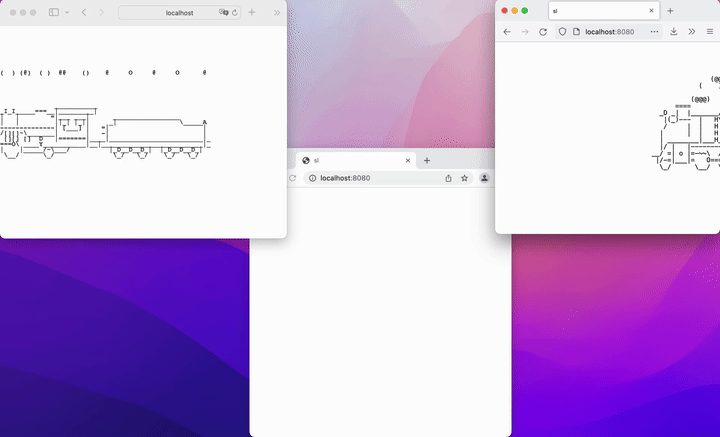

# sl-web

Do you know the `sl` command? You know, that funny train command every "Top 100 Linux Commands" post tells you about? Yeah, imagine that, but like, it's a web app and, like, the train can move between computers.

